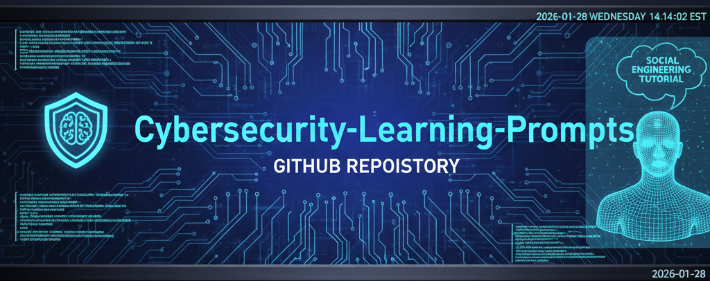

  

<h1 align="center">Cybersecurity Learning Prompt Library</h1>
<h3 align="center">By Scott Malin — Cybersecurity & Automation Architect</h3>

Interactive, gamified, and scenario‑driven cybersecurity learning experiences designed to build intuition, strengthen reasoning, and teach security concepts through exploration and challenge.

  
  
  
  
  
  
  

---

# ⭐ Featured Learning Experience

### **Cyberscam Survival Simulator.md**  
**Goal:** Teach users to identify, resist, and analyze social engineering attacks through an adaptive, branching simulation.

---

# 🎓 Featured Workshop

### **Signal vs Noise – Team Adversarial Judgment Workshop.md**  
**Goal:** Train teams to collaboratively distinguish meaningful security signals from irrelevant noise through structured adversarial reasoning.

This workshop is designed for:
- Security teams  
- SOC analysts  
- Red/Blue/Purple team exercises  
- Classroom or corporate training environments  

Participants work through escalating scenarios where they must:
- Identify true indicators of compromise  
- Challenge assumptions  
- Justify reasoning under pressure  
- Collaborate to reach consensus  
- Communicate uncertainty effectively  

Pairs well with the **Adversarial Judgment Trainer** for pre‑work or follow‑up practice.

---

# 📘 Overview

This repository contains **learning‑focused cybersecurity prompts** designed to:

- Build intuition through interactive reasoning  
- Teach concepts through guided exploration  
- Simulate real‑world attack and defense scenarios  
- Support facilitator‑led and self‑paced learning  
- Provide repeatable, structured cybersecurity education  
- Strengthen communication skills across technical and non‑technical audiences  

These prompts are ideal for:
- Security awareness programs  
- Classroom or workshop facilitation  
- Corporate training  
- Personal skill development  
- Interview preparation  
- Gamified learning environments  

---

# 📁 Repository Structure & Goals

Below is the full file list with **goal statements** for clarity and governance.

---

## 🎮 Interactive Learning Games
- **Cyberscam Survival Simulator.md**  
  *Goal:* Simulate scam scenarios and teach safe decision‑making.  
- **Incident Command - IR Simulator game.md**  
  *Goal:* Walk users through incident response decision‑making under pressure.  
- **Cybersecurity Design Challenge Game.md**  
  *Goal:* Teach secure design thinking through creative problem‑solving challenges.  

---

## 🧠 Reasoning & Critical Thinking Prompts
- **Adversarial Tutor – Security Reasoning Edition.md**  
  *Goal:* Strengthen analytical thinking through adversarial questioning.  
- **Explain It Wrong (On Purpose) – Security Edition.md**  
  *Goal:* Teach concepts by intentionally explaining them incorrectly and having the user correct them.  
- **Enterprise defense anatomy – identification & reasoning.md**  
  *Goal:* Help users break down and reason about enterprise defense components.  
- **Signal vs Noise – Adversarial Judgment Trainer.md**  
  *Goal:* Train users to distinguish meaningful signals from irrelevant noise in security scenarios.  
- **Signal vs Noise – Team Adversarial Judgment Workshop.md**  
  *Goal:* Facilitate group‑based adversarial reasoning and collaborative decision‑making.  

---

## 📝 Security Awareness & Education
- **Plain-English Security Concept Explainer.md**  
  *Goal:* Translate complex security concepts into simple, accessible language.  
- **Security Awareness Quiz.md**  
  *Goal:* Provide a general‑purpose cybersecurity knowledge quiz.  
- **Social Engineering specific quiz.md**  
  *Goal:* Test understanding of social engineering tactics and defenses.  
- **Facilitator-Led Security Awareness Quiz.md**  
  *Goal:* Support instructors delivering live security awareness sessions.  

---

## 🎯 Personalized Learning Engines
- **Security Awareness Personalization Engine (Interview).md**  
  *Goal:* Build a personalized security awareness profile through interview‑style questioning.  
- **Security Awareness Personalization Lab (Facilitator-Led).md**  
  *Goal:* Enable trainers to tailor content to learners in real time.  

---

## 🗣️ Communication & Stakeholder Alignment
- **Security Stakeholder Translator & Communication Coach.md**  
  *Goal:* Help users translate technical findings into stakeholder‑appropriate language.  
- **The Boardroom Translator.md**  
  *Goal:* Teach users to communicate risk, impact, and strategy at an executive level.  

---

## 📄 Repo Files
- **LICENSE**  
- **README.md** (this file)

---

# 🕒 Version History / Changelog

### **v1.4 — February 2026**
- Added Signal vs Noise judgment training prompts  
- Added Security Stakeholder Translator & Communication Coach  
- Added The Boardroom Translator  
- Added Security Awareness Personalization Lab (Facilitator‑Led)  
- Added Security Awareness Personalization Engine (Interview)  
- Added Featured Workshop section  
- Added new shields (Interactive, Gamified, Facilitator‑Ready)  
- Updated categories and repository structure  
- Updated badges and last‑updated date  

### **v1.3 — January 2026**
- Added Cyber Blue banner  
- Unified README structure  
- Added goal statements for all prompts  
- Added featured learning experience  
- Standardized cross‑repo navigation  
- Updated file list and categories  

---

# 🔗 Cross‑Repo Navigation

- 🛡️ **Cybersecurity Prompts**  
  https://github.com/scottmalin68-commits/Cybersecurity-Prompts  

- 🎮 **Learning Games Prompt Library**  
  https://github.com/scottmalin68-commits/Learning-Games-Prompts  

- 🧰 **PowerShell Security & Automation Toolkit**  
  https://github.com/scottmalin68-commits/Powershell_Scripts  

- 🧩 **Misc AI Prompt Library**  
  https://github.com/scottmalin68-commits/Misc-AI-Prompts  

- 🧭 **GitHub Profile**  
  https://github.com/scottmalin68-commits  

---

# 📜 License  
MIT License — see `LICENSE` for details.
