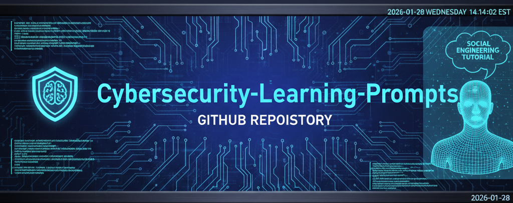

# Cybersecurity Learning Prompt Library

### By Scott Malin — Cybersecurity & Automation Architect

Interactive, gamified cybersecurity learning experiences that build intuition, sharpen reasoning, and teach security concepts through hands‑on exploration and challenge.

---

## ⭐ Featured Learning Experience

### **Cyberscam Survival Simulator.md**

**Goal:** Teach users to identify, resist, and analyze social engineering attacks through an adaptive, branching simulation.

**What you’ll experience:**
- Realistic scam scenarios with escalating pressure  
- Decision‑driven outcomes that adapt to user choices  
- Embedded reasoning challenges that reinforce safe behavior  

### **Cybersecurity Socratic Mentor.md** (v2.0.1)

**Goal:** Mentor beginner and junior learners with Socratic escalation, evidence-based reasoning, no fabrication, documentation-first practice, and lab-safety rules. Added September 2026; trimmed in v2.0.1 for clarity without dropping core safeguards.

---

## 🎓 Featured Workshop

### **Signal vs Noise – Team Adversarial Judgment Workshop.md**

**Goal:** Train teams to collaboratively distinguish meaningful security signals from irrelevant noise through structured adversarial reasoning.

**Best for:**
- Security teams  
- SOC analysts  
- Red/Blue/Purple team exercises  
- Classroom or corporate training environments  

**Participants will:**
- Identify true indicators of compromise  
- Challenge assumptions and justify reasoning  
- Communicate uncertainty effectively  
- Collaborate under time pressure  

Pairs well with the **Adversarial Judgment Trainer** for pre‑work or follow‑up practice.

---

## 📘 Overview

This repository provides a curated library of cybersecurity learning prompts designed to:

- Build intuition through interactive reasoning  
- Teach concepts through guided exploration  
- Simulate real‑world attack and defense scenarios  
- Support facilitator‑led and self‑paced learning  
- Strengthen communication skills across technical and non‑technical audiences  
- Provide repeatable, structured cybersecurity education  

Ideal for:

- Security awareness programs  
- Classroom or workshop facilitation  
- Corporate training  
- Personal skill development  
- Interview preparation  
- Gamified learning environments  

---

## 🧭 Who This Is For

- Cybersecurity learners at all levels  
- SOC analysts and security teams  
- Educators, trainers, and facilitators  
- Corporate learning and development groups  
- Individuals preparing for interviews or certifications  

---

## 🧱 Learning Design Principles

- Interactive first — learning through doing  
- Reasoning over recall — focus on judgment, not memorization  
- Human‑centric — emphasize communication, behavior, and decision‑making  
- Facilitator‑ready — built for workshops and team exercises  
- Modular — each file stands alone or can be combined into learning paths  
- Session-stable — September 2026 updates lock state, HUD/output templates, and jailbreak handling for long games  

---

## 🧰 How to Use This Repository

Use these prompts to run workshops, facilitate training sessions, build custom learning paths, or practice cybersecurity reasoning individually. Each file includes a clear goal statement and is structured for repeatable use.

---

## 📁 Repository Structure & Goals

Below is the full file list with goal statements for clarity and governance.

---

## 🎮 Interactive Learning Games

- **Cyberscam Survival Simulator.md** — Simulate scam scenarios and teach safe decision‑making.  
- **Incident Command - IR Simulator game.md** — Walk users through incident response decision‑making under pressure.  
- **Cybersecurity Design Challenge Game.md** — Teach secure design thinking through creative problem‑solving challenges.  
- **Escape Room — Adaptive Cybersecurity Learning Game Prompt.md** — Guide users through adaptive, puzzle‑based escape room scenarios to apply cybersecurity knowledge.  
- **AI Security Dojo.md** — Ranked practice engine with XP, status-panel state protection, and comeback recovery.  

---

## 🧩 Gamified & Challenge-Based Prompts

- **Security Myth Buster.md** — Challenge and debunk common cybersecurity myths through interactive reasoning.  
- **Threat Model the Human.md** — Teach human‑centric threat modeling by identifying behavioral vulnerabilities and social engineering vectors.  

---

## 🧠 Reasoning & Critical Thinking Prompts

- **Adversarial Tutor – Security Reasoning Edition.md** — Strengthen analytical thinking through adversarial questioning (v1.4.2).  
- **Explain It Wrong (On Purpose) – Security Edition.md** — Teach concepts by intentionally explaining them incorrectly and having the user correct them.  
- **Enterprise defense anatomy – identification & reasoning game.md** — Help users break down and reason about enterprise defense components.  
- **Signal vs Noise – Adversarial Judgment Trainer.md** — Train users to distinguish meaningful signals from irrelevant noise.  
- **Signal vs Noise – Team Adversarial Judgment Workshop.md** — Facilitate group‑based adversarial reasoning and collaborative decision‑making.  

---

## 📝 Security Awareness & Education

- **Plain-English Security Concept Explainer.md** — Translate complex security concepts into simple language.  
- **Security Awareness Quiz.md** — Provide a general‑purpose cybersecurity knowledge quiz.  
- **Social Engineering specific quiz.md** — Test understanding of social engineering tactics and defenses.  
- **Facilitator-Led Security Awareness Quiz.md** — Support instructors delivering live security awareness sessions.  
- **Security Concept of the Day.md** — Deliver daily bite‑sized cybersecurity concepts for ongoing learning.  
- **Live Scam Threat Briefing.md** — Current-consumer scam briefing with locked social-post delivery rules (v1.5.1).  

---

## 🎯 Personalized Learning Engines & Tutors

- **Security Awareness Personalization Engine (Interview-Driven).md** — Build a personalized security awareness profile through interview‑style questioning.  
- **Security Awareness Personalization Lab (Facilitator-Led, Game-Based).md** — Enable trainers to tailor content to learners in real time with game elements.  
- **Cybersecurity Socratic Mentor.md** — Beginner/junior Socratic mentor with evidence rules and a first-week plan (v2.0.1).  
- **Interactive Security Tutor.md** — Defensive-security tutor with level auto-detection and confusion triggers.  
- **AI Fundamentals Interactive Tutor Engine.md** — Adaptive two-turn lesson flow with onboarding/resume commands (v1.2.1).  
- **Authentication Evolution Teaching Engine.md** — Depth-triggered auth teaching (basic / intermediate / advanced) (v1.1.1).  

---

## 🗣️ Communication & Stakeholder Alignment

- **Security Stakeholder Translator & Communication Coach.md** — Translate technical findings into stakeholder‑appropriate language.  
- **The Boardroom Translator.md** — Teach users to communicate risk, impact, and strategy at an executive level.  

---

## 📄 Repo Files

- BANNER_Cybersecurity-Learning-Prompts.png  
- LICENSE  
- README.md  

---

## 🛠️ Contributing

Contributions are welcome. New learning games, reasoning prompts, and facilitator‑ready modules should include a clear goal statement and follow the existing category structure.

---

## 🗺️ Roadmap

- Additional adaptive learning games  
- Role‑specific communication translators  
- Expanded facilitator‑ready workshop kits  
- Scenario packs for phishing, insider threat, and cloud security  
- Optional scoring engines for quizzes and reasoning games  

---

## 🕒 Version History / Changelog

### v1.6 — September 2026
- Added Cybersecurity Socratic Mentor (v2.0.1)  
- Added AI Security Dojo, AI Fundamentals Interactive Tutor Engine, Authentication Evolution Teaching Engine, Interactive Security Tutor, Live Scam Threat Briefing  
- Hardened IR simulator, Myth Buster, Signal vs Noise trainer/workshop, Boardroom Translator, quizzes, and games with state locks, HUD/output templates, and jailbreak handling  
- Badge and catalog brought current to Sep 2026  

### v1.5 — February 10, 2026
- Added Escape Room — Adaptive Cybersecurity Learning Game Prompt  
- Added Security Myth Buster and Threat Model the Human  
- Embedded banner image and expanded badge suite  

### v1.4 — February 2026
- Added Signal vs Noise judgment training prompts  
- Added communication‑focused tools and personalization engines  

### v1.3 — January 2026
- Added Cyber Blue banner, unified README structure, and goal statements  

---

## 🔗 Cross-Repo Navigation

🛡️ Cybersecurity Prompts  
https://github.com/scottmalin68-commits/Cybersecurity-Prompts

💼 Job Search & Career Prompts  
https://github.com/scottmalin68-commits/Job-Search-Career-Prompts

🎮 Learning Games Prompt Library  
https://github.com/scottmalin68-commits/Learning-Games-Prompts

🧩 Misc AI Prompt Library  
https://github.com/scottmalin68-commits/Misc-AI-Prompts

🧰 PowerShell Security & Automation Toolkit  
https://github.com/scottmalin68-commits/Powershell_Scripts

🧭 GitHub Profile  
https://github.com/scottmalin68-commits

---

## 📜 License

MIT License — see LICENSE for details.

---

Part of the **Scott Malin Cybersecurity Learning Ecosystem** — a modular suite for reasoning, communication, and hands‑on security education.
